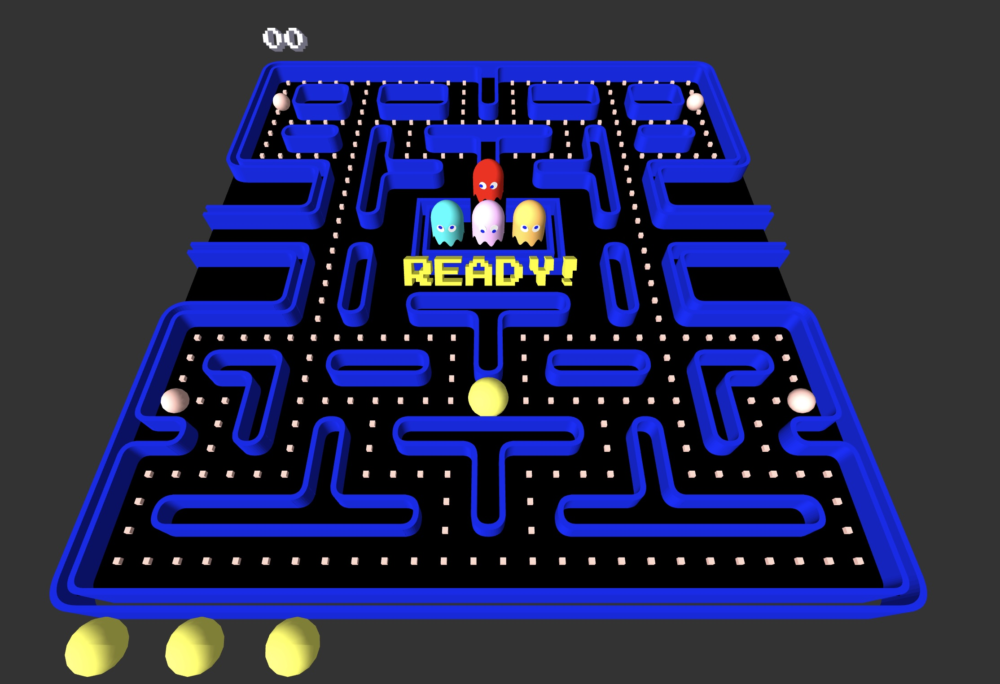

## PacMan 3D

This is a 3D PacMan game implementation using Kotlin/JS and three.js

It is a tribute to the original PacMan game and and re-creating a gameplay this close to the original was made possible by the awesome [Pac-Man Dossier](https://www.gamasutra.com/view/feature/3938/the_pacman_dossier.php?print=1) by Jamey Pittman.

It's still a work-in-progress, but already completely playable.

A live version will be uploaded soon.

